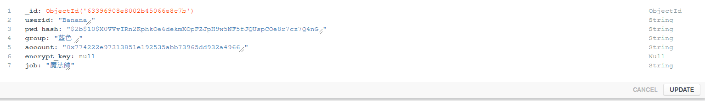

This is express server.
You can run this server with "npm start"app.js

How to begin:
1. First of all, you have to build a mongoDB.
your monogoDB will like this:

2. set your mongoDB port and ip in api_server.js.
3. run "npm start". That is all.
4. If you want to use this to communicate with my dapp, please come [here](https://github.com/Yorkchung/Dapp_NFT) and clone this code.

Don't forget to give me a start. Thank you!!